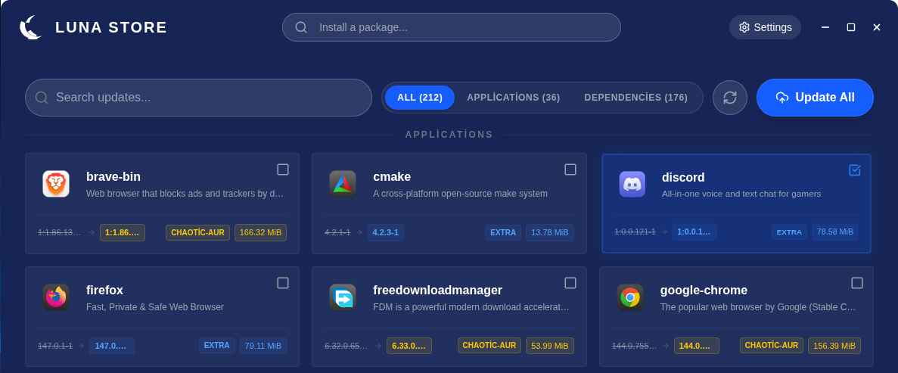
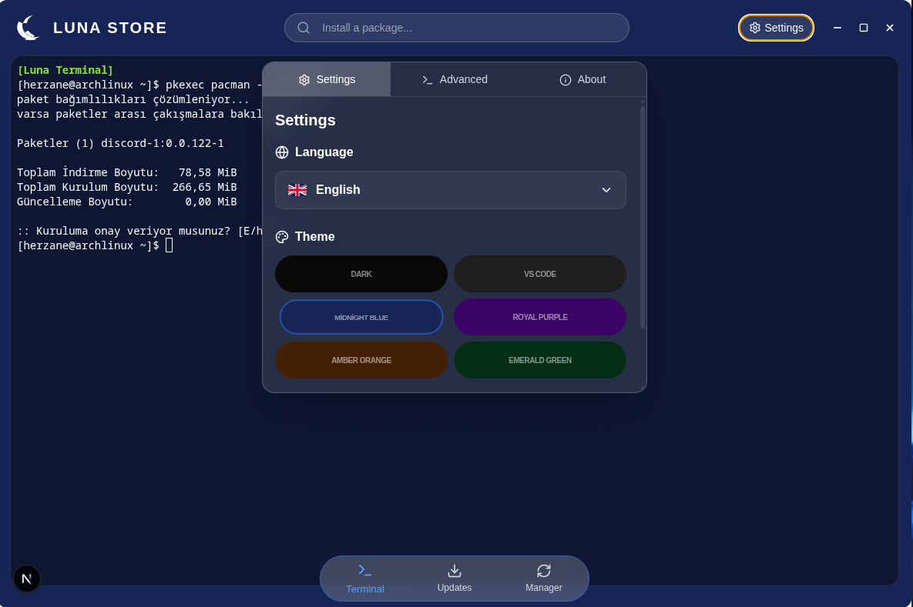
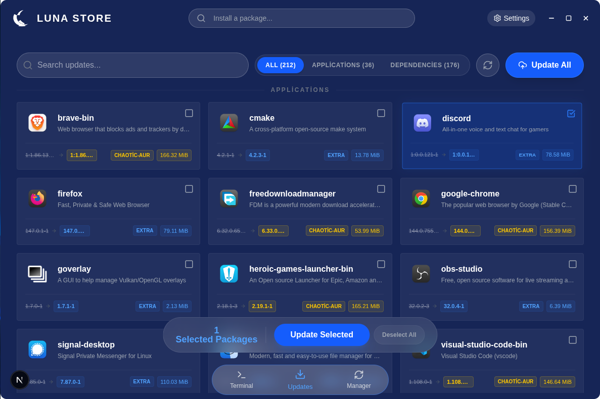
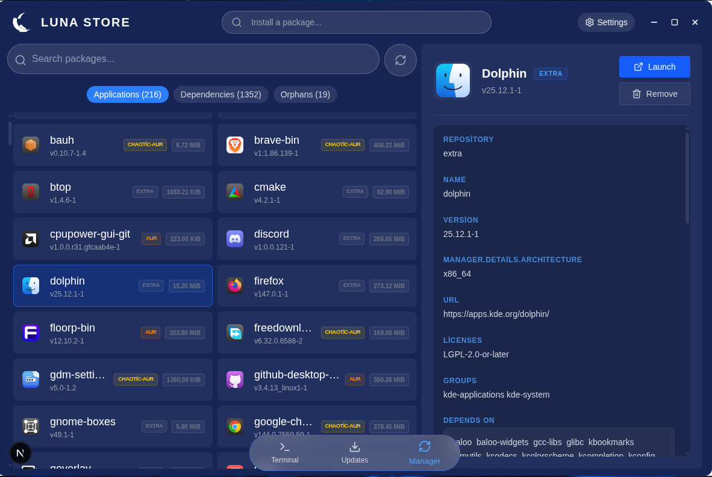

<p align="center">
  
</p>

<h1 align="center">Luna Store (Electron Version)</h1>
<p align="center"><i>Modern and Fast Package Management Application for Arch Linux</i></p>

<p align="center">
  <a href="https://archlinux.org"></a>
  <a href="https://www.electronjs.org/"></a>
  <a href="https://www.gnu.org/licenses/gpl-3.0"></a>
</p>

<p align="center">
  <b><a href="readme.md">English</a> | <a href="Github/Readme/readme-fr.md">Français</a> | <a href="Github/Readme/readme-tr.md">Türkçe</a></b>
</p>

---

## ✨ Features

- 🎨 **Modern Interface:** Customizable color options, dark mode support, and an aesthetic design that feels premium.
- 📦 **Package Management:** Easily track installed packages, install new ones with one click, or remove them from the system (Manager page).
- 🔄 **System Updates:** Instant tracking of all updates in the repositories and one-click bulk update capability.
- 🔍 **Smart Search:** Fast searching in Pacman and AUR repositories, category-based filtering, and detailed package information.
- 🐚 **Integrated Terminal:** High-performance embedded terminal where you can monitor all installation and removal processes in real-time.
- 🌐 **Language Support:** Currently available in **Turkish, English, and French**.
- 🛠️ **Management Tools:** Utility tools for cleaning orphan packages and system optimization.

---

## 🚀 Tested Environments

The application has been personally tested and works smoothly in the following environment:
- **Operating System:** Arch Linux
- **Desktop Environment:** KDE Plasma
- **Display Server:** Wayland

> [!NOTE]
> It is also expected to work on other desktop environments (GNOME, XFCE, etc.) and X11; please report if you encounter any issues.

---

## 📦 Requirements

To run the application, an **Arch Linux-based distribution** (Manjaro, EndeavourOS, etc.) and the following packages are required:

- `pacman` (System package manager)
- `pacman-contrib` (Required for update checking)
- `polkit` / `pkexec` (Required for authentication)
- `yay` or `paru` (Recommended for AUR support)

---

<h2 align="center">📸 Screenshots</h2>

<p align="center">
      
      <br>
      
      <br>
      
</p>

---

## 🛠️ Installation and Development

To run or package the project on your local machine:

### 1. Preparation
```bash
# Clone the repo
git clone https://github.com/herzane52/luna-store-electron.git
cd luna-store-electron

# Install dependencies
npm install
```

### 2. Development Mode
```bash
# Terminal 1: Start Frontend (Next.js) dev server
npm run next:dev

# Terminal 2: Start the Application (Electron)
npm run electron
```

> The development server (`next:dev`) may take some time to get ready. Please make sure the server is fully started (Ready) in the terminal before starting Electron, otherwise you may encounter connection errors.

### 3. Packaging (Build)
```bash
# First build the frontend
npm run next:build

# Generate Linux packages (.pacman, .AppImage)
npm run build:linux
```

---

## 📄 License
This project is protected under the **GPL-3.0** license. For more information, you can check the [LICENSE](LICENSE) file.

<p align="center">
  With love to the Arch Linux community. ❤️
</p>
